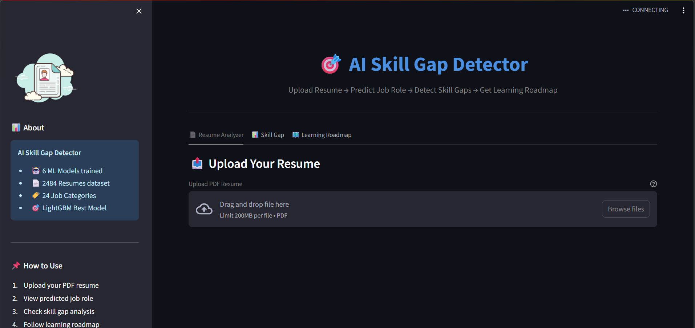
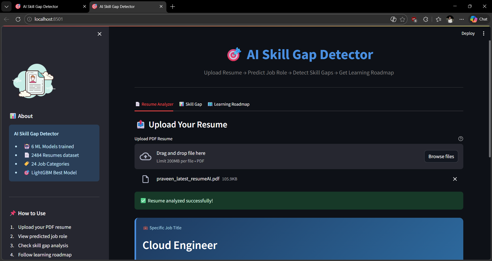
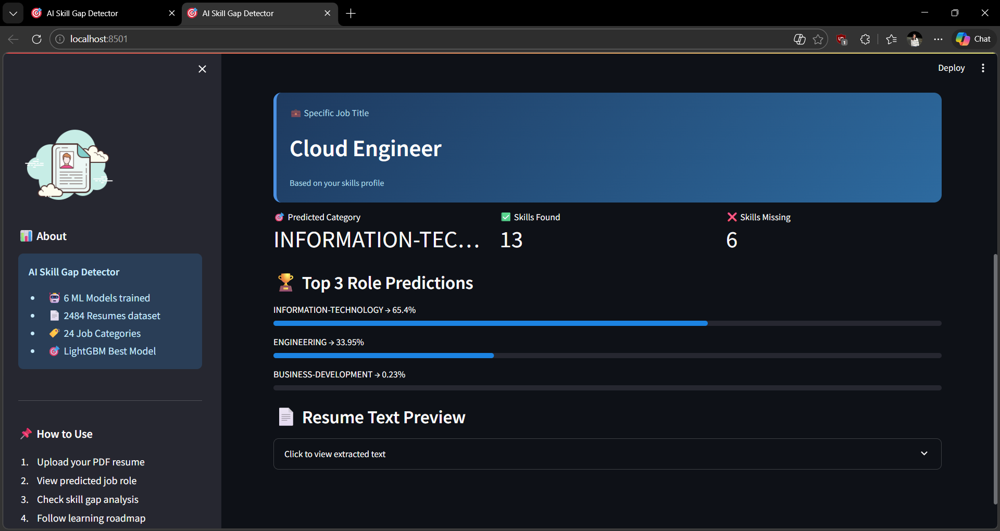
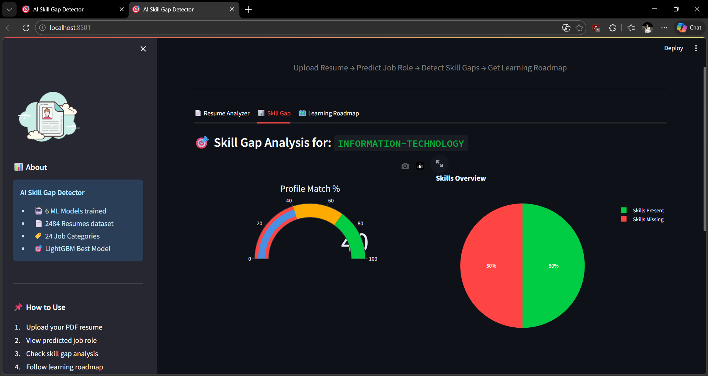
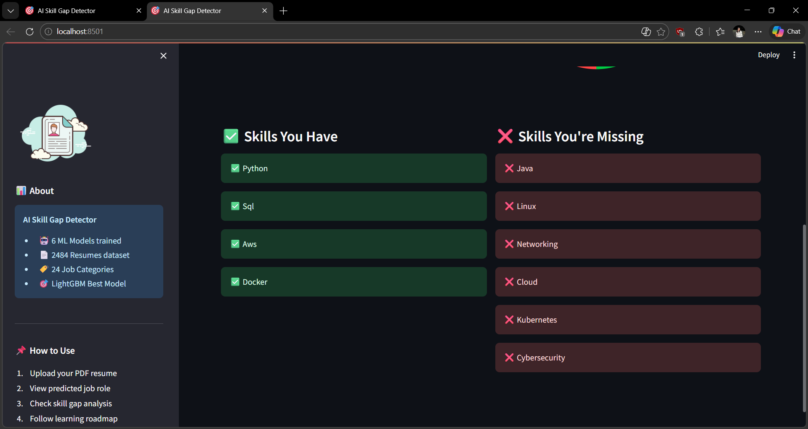
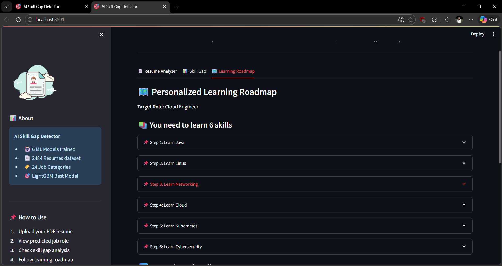
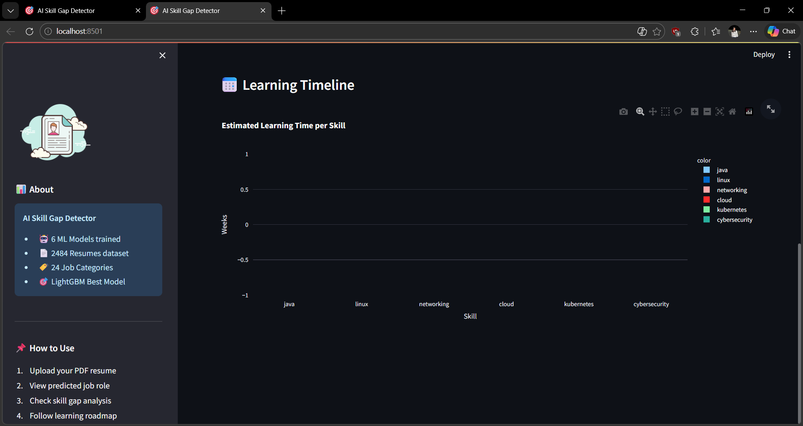

<div align="center">

# 🎯 AI Skill Gap Detector
### *Upload Resume → Predict Job Role → Detect Skill Gaps → Get Learning Roadmap*


> An AI-powered resume analyzer built for fresh graduates and students to identify skill gaps and get personalized learning roadmaps — no manual input needed, just upload your PDF resume.

</div>

---

## 📸 App Preview

### 🏠 Home — Upload Resume


### 📄 Resume Analyzer — Instant Analysis


### 🏆 Top 3 Role Predictions with Confidence Scores


### 📊 Skill Gap Analysis — Gauge Chart + Pie Chart


### ✅ Skills You Have vs ❌ Skills You're Missing


### 🗺️ Personalized Learning Roadmap


### 📅 Learning Timeline — Estimated Time per Skill


---

## ✨ Features

| Feature | Description |
|---------|-------------|
| 📄 PDF Resume Parsing | Automatic text extraction using PyMuPDF |
| 🤖 ML Role Prediction | Predicts from 24 job categories with confidence scores |
| 🏆 Top 3 Predictions | Shows 3 most likely roles with probabilities |
| 📊 Visual Analytics | Gauge chart for profile match %, pie chart for skills |
| 🎯 Skill Gap Detection | Compares your skills vs required skills for your role |
| 🗺️ Learning Roadmap | Prioritized step-by-step plan with curated course links |
| 📅 Learning Timeline | Bar chart with estimated time to learn each skill |

---

## 🤖 ML Models Trained & Compared

| Model | Accuracy |
|-------|----------|
| Naive Bayes | ~88% |
| Logistic Regression | ~93% |
| Random Forest | ~93% |
| SVM | ~97% |
| XGBoost | ~97% |
| ✅ **LightGBM (Best)** | **~98%** |

**Winner: LightGBM Classifier** — fastest training + highest accuracy

---

## 📊 Dataset

| Property | Value |
|----------|-------|
| Source | [Kaggle Resume Dataset](https://www.kaggle.com/datasets/snehaanbhawal/resume-dataset) |
| Total Resumes | 2,484 |
| Job Categories | 24 |
| Train Split | 80% (1,987 samples) |
| Test Split | 20% (497 samples) |
| Strategy | Stratified split |

---

## 🏷️ 24 Supported Job Categories

```
INFORMATION-TECHNOLOGY  │  DATA-SCIENCE        │  BUSINESS-DEVELOPMENT
ADVOCATE                │  CHEF                │  ENGINEERING
ACCOUNTANT              │  FINANCE             │  FITNESS
AVIATION                │  SALES               │  BANKING
HEALTHCARE              │  CONSULTANT          │  CONSTRUCTION
PUBLIC-RELATIONS        │  HR                  │  DESIGNER
ARTS                    │  TEACHER             │  APPAREL
DIGITAL-MEDIA           │  AGRICULTURE         │  AUTOMOBILE  │  BPO
```

---

## 🛠️ Tech Stack

| Layer | Technology |
|-------|-----------|
| 🖥️ Frontend | Streamlit 1.32.0 |
| 🤖 ML Model | LightGBM Classifier |
| 🔤 Feature Extraction | TF-IDF (1500 features, bigrams) |
| 📄 PDF Parsing | PyMuPDF (fitz) |
| 📊 Visualization | Plotly (gauge, pie, bar charts) |
| 🐍 Language | Python 3.11 |
| 🏋️ Training | Google Colab |

---

## 📁 Project Structure

```
ai-skill-gap-detector/
│
├── 📄 app.py                     # Main Streamlit application
│
├── 📁 models/
│   ├── best_model.pkl            # Trained LightGBM model (~98% acc)
│   ├── tfidf_vectorizer.pkl      # TF-IDF vectorizer (1500 features)
│   └── label_encoder.pkl         # Label encoder (24 categories)
│
├── 📁 screenshots/               # App preview images
│
├── 📄 requirements.txt           # Python dependencies
└── 📄 README.md
```

---

## ⚙️ How to Run Locally

### 1. Clone the repository
```bash
git clone https://github.com/dimplebhardwaj536-dotcom/Ai-skill-gap-detector.git
cd Ai-skill-gap-detector
```

### 2. Create virtual environment (Python 3.11 required)
```bash
python -m venv venv
venv\Scripts\activate        # Windows
source venv/bin/activate     # Mac/Linux
```

### 3. Install dependencies
```bash
pip install -r requirements.txt
```

### 4. Run the app
```bash
streamlit run app.py
```

### 5. Open in browser
```
http://localhost:8501
```

---

## 🔄 ML Pipeline

```
📄 PDF Resume Upload
        ↓
📝 Text Extraction (PyMuPDF)
        ↓
🧹 Text Cleaning (regex — remove URLs, emails, special chars)
        ↓
🔢 TF-IDF Vectorization (max_features=1500, ngram_range=(1,2))
        ↓
🤖 LightGBM Prediction (24 categories, ~98% accuracy)
        ↓
🔍 Skill Extraction (keyword matching against skills database)
        ↓
📊 Skill Gap Detection (present vs missing skills)
        ↓
🗺️ Personalized Learning Roadmap (prioritized + course links)
```

---

## 🧠 Model Training Details

Trained in **Google Colab** with the following steps:

1. Downloaded dataset using `kagglehub`
2. Cleaned text — removed URLs, emails, phone numbers, special characters
3. Label encoded 24 job categories
4. Applied TF-IDF vectorization (`max_features=1500`, `ngram_range=(1,2)`)
5. Trained and compared 6 ML models using stratified 80/20 split
6. Selected **LightGBM** as best model (~98% accuracy)
7. Saved `best_model.pkl`, `tfidf_vectorizer.pkl`, `label_encoder.pkl`

---

## ⚠️ Known Limitations

- Skill detection is keyword-based, not semantic
- Model trained on a specific Kaggle dataset — niche roles may have lower accuracy
- Requires **Python 3.11** for full compatibility (Python 3.14 not supported)

---

## 🔮 Future Improvements (v2.0)

- [ ] BERT/RoBERTa fine-tuning for 99%+ accuracy
- [ ] Semantic skill matching using sentence embeddings
- [ ] LinkedIn URL parsing
- [ ] Live job scraping for real-time skill demand
- [ ] AI Career Chat (Gemini/GPT powered)
- [ ] Deploy on Hugging Face Spaces
- [ ] RAG-based career Q&A system

---

## 📄 License

MIT License — free to use, modify, and distribute.

---

<div align="center">
Built with ❤️ to help fresh graduates bridge their skill gaps and land their dream jobs.

⭐ Star this repo if you found it helpful!
</div>
